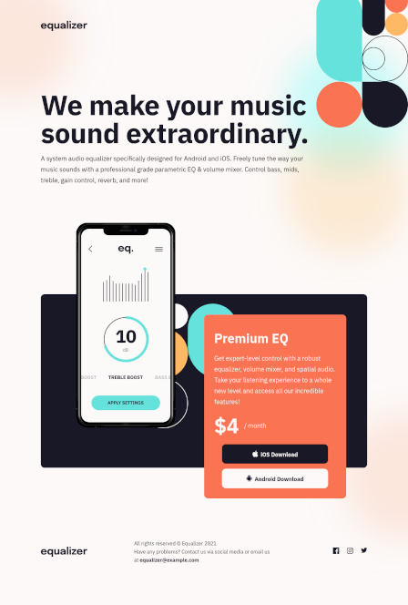

# Frontend Mentor - Equalizer landing page solution

This is a solution to the [Equalizer landing page challenge on Frontend Mentor](https://www.frontendmentor.io/challenges/equalizer-landing-page-7VJ4gp3DE).
Frontend Mentor challenges help you improve your coding skills by building realistic projects.

## Table of contents

- [Overview](#overview)
  - [The challenge](#the-challenge)
  - [Screenshot](#screenshot)
  - [Links](#links)
- [My process](#my-process)
  - [Built with](#built-with)
  - [What I learned](#what-i-learned)
  - [Continued development](#continued-development)
  - [Useful resources](#useful-resources)
- [Author](#author)
- [Acknowledgments](#acknowledgments)

## Overview

### The challenge

Users should be able to:

- View the optimal layout depending on their device's screen size
- See hover states for interactive elements

### Screenshot

### Links

- [My Solution - Source Code](https://github.com/bradleyhop/frontend-mentor-equalizer/tree/main)
- [Live Site](https://bradleyhop.github.io/frontend-mentor-equalizer/)

## My process

### Built with

- Semantic HTML5 markup
- CSS custom properties
- Flexbox
- Mobile-first workflow
- [Vue 3](https://vuejs.org/) - JS library
- [Vite](https://vitejs.dev/) - Vite Frontend Tooling
- [SCSS](https://sass-lang.com/) - For styles

### What I learned

#### Mobile-first workflow

It seems obvious now, but I didn't actually understand mobile-first. In the
past, I always put mobile styling first with larger device media queries after,
but I was still building the desktop layout first. This project's design made
this workflow very difficult. However, as I continue to learn, I've found that
building from the mobile design first made the larger devices easier to adjust.

#### Building a Site From a Design File

My first project with Frontend Mentors, I was setting the size and positions of
elements of the site using the pixels given in the Figma file as absolutes. This
project is more complicated, and so that strategy quickly came apart. After
some research, I have now a better idea on what info to glean from a design file
and write the code that keeps to the spirit, as close as possible, to the spirit
of the design.

### Continued development

I plan on sharpening my skills with CSS and Sass as I continue to build sites
through Frontend Mentor and their design files.

### Useful resources

- [Kevin Powell's YouTube Channel](https://www.youtube.com/kepowob/featured) - I
  appreciate Kevin's teaching style and focus in his videos. I watched several
  of his videos as I was building this project and picked up these hot tips,
  among others:

  - how to build from mobile-first design
  - using min-height instead of height CSS attribute, if a height needs to be
      set at all, to prevent overflow
  - tips on building a site from a design file
  - the differences and importance in ch, em, and rem and to generally avoid
      setting px for lengths

- [Figma File to Code. The Designer to Developer Handoff w/ Frontend Mentor Founder HTML+CSS Tutorial](https://www.youtube.com/watch?v=PY_iIeAKFw0) - An amazing first part video series that helped me mentally wrap my mind around on how to approach this project and how to roughly plan the code structure before even opening the text editor. Unfortunately, the second and third parts are behind paywalls.

## Author

- Website - [Bradley Smith](https://bradleysmith.tech)
- Frontend Mentor -
  [@bradleyhop](https://www.frontendmentor.io/profile/bradleyhop)

## Acknowledgments

I look forward to any feedback and encouragement that I might recive from the
Frontend Mentor community.
